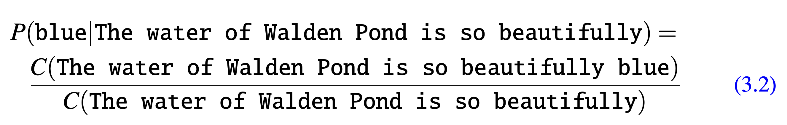
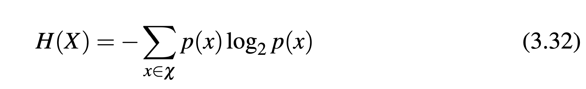

# Blokedin 0-1
Do you like to block people? I do! Let's block them with ML, just for fun.

We're gonna implement some ML techniques to block people based on their first message sent and evaluate which one performs better.


## Learning
This is a series of lectures to show what natural language processing (NLP) techniques are. We start simple from scratch and then build up to more complex architectures like Transformers and LLaMA.

This is for educational purpose only. We'll implement everything (almost) from scratch to learn machine learning techniques for natural language processing.

Aim is to understand how things work under the hood. We like the hood.

This is a supervised classification problem as we know the target when training the model and the target is a qualitative variable.

Maybe we create this with some assignments after the course is finished.


This course is also part of the Machine Learning course but covering the NLP side, some techinques are reusable.


## Setup

```sh
python3.11 -m venv .venv
source .venv/bin/activate
pip install torch tensorflow matplotlib numpy pandas
```


## resources
- https://web.stanford.edu/~jurafsky/slp3/
- https://www.youtube.com/watch?v=Rvppog1HZJY (Stanford, funnily released on 2025-04-08)
- TODO include the CMU advanced course fall 2024
- TAD lectures slides
- TODO read and see if it helps https://course.fast.ai/ (it's not all NLP though) (maybe list it as a resource, )
- TODO write the history of nlp as in this video https://www.youtube.com/watch?v=Rvppog1HZJY
- TODO include any other useful resource here

## Lecture One
mainly following the Speech and Language Processing book
- Tokenization
- Regular Expressions
- Edit Distance
- BPE, what was before BPE?? what's the BPE paper? include it here

### Regular Expressions, Tokenization, Edit Distance (maybe/?)
ELIZA was a chatbot like program using pattern recognition phrases like "I need X" and translate into suitable output like "what would you do if you got X?". It didn't know anything about the world, it was like a listener that acts like knowing nothing.

One tool to describe text pattern is **regular expression**, for example to extract strings from document.
**text normalization** means converting it to a more convenient standard form.
**tokenization** separating words or word parts from the text document, e.g. english words are separated by whitespace (not always sufficient).
for tweets for example we'd need to tokenize the **emoticons** :) or **hashtag** #nlp.
some languages are hard to tokenize as they don't have spaces, e.g. japanese.
we'd need sometimes to tokenize subwords, short phrases, letters for large LLMs.
another part of text normalization is **lemmatization**, the task of determining that words have the same root, e.g. *sang*, *sung*, *sings* are form of the verb *sing*. *sing* is the common *lemma* of these words. A **lemmatizer** maps from all these to *sing*.
**stemming** is a simpler form of lemmatization in which we just strip suffixes from the end of the word.
Text normalization also includes **sentence segmentation**, breaking text into sentences using cues like periods or exclamation.
The metric **edit distance** measures how similar two strings are based on number of edits (insertion, deletion, substitution) it takes to change one string into another.

#### Regular Expressions
regex is a language for specifying text search strings, used e.g. in `grep`, `vim`.
very useful when we have a **pattern** to search for in a **corpus** to search through.
a regex will search through the corpus returning all the pattern matches.
the corpus can be a single document or a collection.
we'll describe the **extended regular expressions**.

regular expression patterns are case sensitive (refer to `./notebooks/lecture_1.ipynb` for more on the actual use case of these):
- concatenation: putting characters in sequence is concatenation, e.g. `/woodchucks/`, `/ubaid/`
- range: using the `[-]` (use of [] is required) to indicate from to a range, e.g. `/[A-Z]/`, `/[0-9]/`, `/[a-z]/`
- Kleene*: * to say how many of something, means zero or more occurrences
- Kleene+: at least one
- wildcard: `.` matches any one character
- anchors: anchor the regular expressions to a particular place in a string
  - `^`   start of line
  - `$`   end of line
  - `\b`  word boundary
  - '\B`  non-word boundary
- **disjunction** operator: `|` specifies either or, e.g. `dog|cat`
- enclosing the sequences with `()` we basically make it like a single character
regualar expressions are **greedy** (match as large as possible) by default but we can use **non-greedy** Kleene operators (match as little as possible). `*?` or `+?`

an example is trying to match all the words `the` in a document
we start with /the/ but we're missing beginning of text for example `The`
so we do this /[Tt]he/
but that we'll also match `other` `there`
so we need word boundary like /\b[Tt]he\b/


^ the above proccess introduces **false positives**, i.e. matching `other` `there`
and also false negatives, i.e. missing correct strings

reducing the overall error of the application involves two antagonists efforts:
- increasing **precision** (minimizing false positives)
- increasing **recall** (minimizing false negatives)


an important part of regular expression is in **substitutions**. e.g. in python or in vim the sub operator like `s/colour/color`

you can use the number operator \1 to refer to a matched pattern back.
this use of parenthese to store a pattern in memory is called **capture group**, every time a capture group is used, the resulting match is stored in a numbered **register**. And you refer to the captured group via numbers like 1, 2, 3, etc..

if we want to use parenthese to not capture the group we can use a non-capturing group via /(?:some|a few) (people|cat) like some \1/
in the example above `\1` would refer to the second parenthese group, i.e. `(people|cat)`

Recall ELIZA, that is using a series of cascade regular expression substitution.
e.g. some are these
```txt
s/.* YOU ARE (depressed|sad) .*/I AM SORRY TO HEAR YOU ARE \1/
s/.* YOU ARE (depressed|sad) .*/WHY DO YOU THINK YOU ARE \1/
s/.* all .*/IN WHAT WAY/
s/.* always .*/CAN YOU THINK OF A SPECIFIC EXAMPLE/
```

##### Words
what does count as a word? we can decide to treat punctuation as a separate word or not depending on the task, e.g. part of speech tagging.
**utterrance** is the spoken correlate of a sentence. 
e.g. "I do uh main- mainly business data processing"
there are two kinds **disfluencies**. `main-` broken word is called **fragment**
where uh um are called **fillers** or **filled-pauses**. should we consider these as words? depends on the application.

to understand better what counts as a word we need to understand **word types**, i.e. number of distinct words in the corpus.
word **instances** are the total number of N of running words, equivalent of word tokens in the past.

do we consider `They` and `they` as two word types or the same? it depends on the task. e.g. for speech recognition same is fine.

the relantionship between the word type and the word instance is referred to by **Herdan's law** or **Heaps' law**.

cats and cat are two differenct **wordforms** but have the same **lemma**. A lemma  is a set of lexical forms having the same stem. The **wordform** is the full inflected or derived form of the word. 

for many LLMs we actually use **tokens** using the **tokenization** process. The token can be a word or a part of the word.

##### Corpora
there are variations genre of text. e.g. from telephone conversations, business meetings, medical interviews, etc..
to understand what a corpus was meant for is thanks to **datasheet** or **data statements** that includes:
- motivation for collecting the corpus
- situation: when and in what situation was text written/spoken
- language variety: what language was the corpus in?
- speaker demographics: what was e.g the age, sex of the text's authors?
- collection process: how big is the data? if it is a subsample how was it sampled? was the data collected with consent? how was the data preprocessed? and what metadata is available?
- annotation process: what are the annotations, how was the data annotated? how was the annotation process?
- distribution: are there copyright or other intellectual property restrictions?


##### Text Normalization
before any natural language processing of a text, the text has to be normalized through the **text normalization** process which involves:
- tokenization (segmentation) words
- normalizing word formats
- segmenting sentences


NOTE: ok at this point we can start collecting the data and do some of text normalization process in a jupyter notebook.


**NOTE what happens when you have a corpus with lots of examples of one label??? we need to explain it in our lectures**

**the other thing we need to deal with the preprocessing or processing of our corpus for our task is the handling of links, we could potentially neglect them, i.e. remove them with a regular expression so we basically showcase the use of how regex are used, we could do that in one type of classification or in the other one we could just keep it or replace with a placeholder like [LINK], we need to keep the script so that it has both versions, for now we don't do anything special.**

- For the above mentioned we should compare the performance of the different solutions.
- Create features engineers.
- Create synthetic data after training the model.
- We could also have one model trained by giving the subject as one of the features.
- We've also included the has_attachment feature and the subject.
- Ideally also when we create the synthetic data we want to be able to generate these features too so in the lecture descriptions we can explain how the original data looked like.
- We should train with capital or lowercase only and se the diffrence and show the difference.**

**how do we deal with the fact that our corpus doesn't have all the words that exists in english vocabulary???**


##### Word and Subword Tokenization
In NLP, we usally break words into **subword tokens**, which can be words or part of words or individual letters.

Tokenization is run before any other language processing.

**Top Down (Rule Based) Tokenization**
In NLP, we usually keep the punctuations and numbers. Then we need to account for hashtags, urls, emails, dates, special chars in words like AT&T, prices (e.g. $45.45), etc...

Can use tokenizer to expand **clitic** contractions marked by apstrophes, e.g. `what're` into `what are`.
A clitic is a part of word that cannot stand on its own.

Tokenization is tied with **named entity recognition**, task of detecting names, dates and organizations.

A common tokenization standard is the **Penn Treebank Tokenization**, where `doesn't` becomes `does n't`.

Word tokenization is more comlex in Chinese and Thai where there are no spaces and the words are composed of characters called **hanzi** (Chinese).
Each character represents a single unit of meaning (**morpheme**).

For some languages like thai we need more than one character to use as a word.

**Byte-Pair Encoding: A Bottom Up Tokenization Algorithm**
We can use the data to tell us what the words should be unlike the previous approach where we either used a character or whitespace or sth more complex. This is very useful to deal with unknown words, very common in NLP.
In NLP, algos learn facts from one corpus (**training** corpus) and use theses facts to make decisions about separate **test** corpus, hence the problem of unknown words.

To solve this problem, tokenizers try to induce **subwords** tokens.

Most tokenizer scheme have 2 parts:
- **token learner**: takes raw training corpus and induces a vocabulary, a set of tokens.
- **token segmenter**: takes raw test sentence and segments it into the tokens vocabulary.

Two algorithms are used:
- **byte pair encoding** (Sennrich et al., 2016)
- **unigram language model** (Kudo, 2018)

**SentencePiece** (Kudo and Richardson, 2018a) has both implementation, but SentencePiece is usually referred to mean as **unigram language model**.


###### BPE
- begin with a vocabulary that is all the individual characters.
- examine training corpus
- choose the two symbols that are most frequently adjacent, e.g. 'A' and 'B'
- add the merged symbol 'AB' to the vocabulary
- replace every adjacent 'A' 'B' with 'AB'
- continue to count and merge creating longer and longer character strings, until k merges have been creating k novel tokens
- k thus becomes the parameter of the algorithm
- the resulting vocabulary consists of the original characters plus k new symbols.

TODO
- implement the BPE algorithm in ocaml
- go through the karpathy implementation of BPE in its video https://youtu.be/zduSFxRajkE


##### Word Normalization, Lemmatization and Stemming
The simplest case of word normalization is **case folding**. e.g. mapping everything to lowercase like `Woodchuck` and `woodchuck` are represented identically, which is very helpful for generalization in tasks like information retrieval or speech recognition.

For sentiment analysis and other text classification tasks, information extraction, machine translation instead case folding is generally not done.

If you use BPE you may not need to do any other normalization.


**lemmatization**
is the task of determining that two words have the same root. e.g. one application of it could be `He is reading detective stories` -> `He be read detective story`

How is lemmatization done?
**morphology** is the study of the of the way words are built up from smaller meaning-bearing units falled **morphemes**.
**stem** is the central morpheme of the word, gives the main meaning
**affixes** adding additional meanings of various kind.
e.g. fox is one morpheme; cats is two `cat` and `s`

Lemmatization algos can be complex, hence we can use a simpler morphological analysis called **stemming**, i.e. chopping off the final affixes.
**Porter Stemming** consists of rewrite rules run in a series. Not commonly used now cause of overgeneralization and undergeneralization.

##### Sentence Segmentation
Usually by using punctuation, e.g. periods, question marks, exclamation. Period is more ambiguous.
Sentence tokenization woks by deciding (machine learning or rule) whether period is part of word or is sentence boundary marker, an abbreviation dictionary can help find abbreviations.


##### Minimun Edit Distance
In NLP one common task is to measure how similar two strings are, e.g. graffe with giraffe.
Another example is **coreference**, i.e. decide whether two strings refers to the same entity.
e.g.
```
Stanford Arizona Cactus Garden.
Stanford University Arizona Cactus Garden.
```
another task of strings similarity is in the quality measure of transcription produced by a speech recognition system, words that differ by a lot have worse quality transcription and those that differ by a few have better quality.

**Edit distance** gives us the technique to quantify these intuitions about similarity.
**Minimum edit distance** is defined as the minimum number of editing operations (insertions, deletions, substitutions) needed to transform one string into another.
We can even assign even a cost to these operations when doing alignment.
The **Levenshtein** distance between two sequences is in which each of these three operations has a cost of 1.


##### Summary
we covered
- regular expression: a powerful tool for pattern matching
- **concatenation** of symbols, **disjunction** ([], |), **counters** (*, +, {n,m}), **anchors** (^, $) and precedence operators ((,)).
- **word tokenization and normalization** 
- **Porter** simplest algorithm for stemming
- **minimum edit distance** using **dynamic programming** and **alignment** of two strings


## Lecture Two (N-Gram Language Models)
can we predict the next word someone says?

we'll introduce what is **language models** or **LMs**.
A language model is a machine learning model that predicts upcoming words. Formally, a language model assigns a **probability** to each possible next word, or equivalently gives a probability distribution over possible next words.

why do we want to predict next words or sentences?
1. generation: we can correct grammar errors

Language models can also help in **augmentative and alternative communication** (ACC).
ACC is used by people that cannot speak or sign but use eye gaze to select words from menu.

Language models learn a lot by just being trained on predicting the next word.

The simplest kind of language model is the **n-gram** language model. An n-gram is a sequence of n-words, e.g. 2-words (**bigram**), 3-words (**trigram**).

The n-gram means probabilistic model that predicts the next word given the n-1 words.


##### N-Grams
we begin with assigning the probability of the next word given a history.

e.g. P(w|h) where h is *"The water of Walden Pond is so beautifully"* and w is *blue*.

one way to estimate this probability is directly using the frequency counts
- take a very large corpus
- count the number of times we see *The water of Walden Pond is so beautifully*
- count the number of times that is followed by *blue*
- this would answer the question "Out of the times we saw history *h*, how many times was it followed by the word *w*



Because language is **creative**, not even the entire web could give a decent estimate to that question.


We may refer to **words** but those are essentially **tokens** as the one implemented in `notebooks/lecture_1.ipynb` BPE algorithm.

>> there's intro/requirement of probability here


**Markov Assumption**
instead of calculating the probability of a word given its entire history, we can **approximate** the history by just the last few words.

The **bigram** model approximates the probability of the next word given all the previous words P(w[n]|w[1, n-1]) by using only the conditional probability given the preceding word P(w[n]|w[1, n-1]). i.e. 

instead of doing this:

```
P(blue|The water of Walden Pond is so beautifully)
```

it does this

```
P(blue|beutifully)
```

The assumption that the probability of the next word depends only on the previous word is called **Markov** assumption. Markov models are a class of probablistic models that assume that we can predict the probablity of some future unit without looking too far into the past.


###### How do we estimate probablities?
how do we estimate the probablities of the bigram or n-gram?
an intuitive way is called **maximum likelihood estimation (MLE)**. We get the MLE for the parameters of an n-gram model by getting the counts from a corpus, and **normalizing** the counts so they lie between 0-1 and sum to 1.

e.g. for a given bigram probability of a bigram w[n] we count the bigram C(w[n-1], w[n]) and divide by the number of occurrences of bigrams starting with w[n-1].

this ratio is called **relative frequency**.

when counting for bigram we need to augment each sentence with the special character `<s>` at the beginnning, so we get the bigram context of the first word.

```
<s> I am Sam </s>
<s> Sam I am </s>
<s> I do not like green eggs and ham </s>
```

depending on the context some words may appear more or less. However, MLE generalize it to the given model so we need a better probability estimate.

e.g. the berkeley restaurant dataset (normalized by removing punctuation and lowercasing)

```
can you tell me about any good cantonese restaurants close by
tell me about chez panisse
i'm looking for a good place to eat breakfast
when is caffe venezia open during the day 
```

##### how do you deal with scale in large n-gram models
language model probablities are stored and computed in log space as **log probablities**.
the reason is cause the probablities are less than or equal to 1, so the more we multiply them together the smaller the product becomes, potentially leading to underflow.
we do all computation and storage in log space and conver back to into probablities if needed by taking the exp of logprob.

```
p1 x p2 x p3 x p4 = exp(logp1 + logp2 + logp3 + logp4)
```

for larger n-grams like trigram or 4grams we'd need to add more pseudo words for the first gram. e.g. `P(I|<s><s>)`

some popular large n-grams datasets are:
- COCA
- 1 billion word corpus of American English
- Google's Web 5-gram from 1 trillion words of English web text
- Google Books Ngrams corpora (many languages)

infini-gram (Liu at al 2024) allows n-grams of any length.

it's standard to quantize the probabilities using only 4-8bits instead of 8 byte floats.

##### Evaluating Language Models: Training and Test Sets
**extrinsic evaluation**: plug the model into an application and measure how much the application improves. This is the only way to evaluate various components of the application together but it's expensive to run large systems end-to-end for two different models.

we need a metric to better evaluate potential improvements in a language model.
**intrinsic evaluation** is a metric that measures the quality of a language model independent of any application.


to evaluate any language model we need 3 datasets, **training set, dev set, test set**.

the **training set** is the data we use to learn the parameters of our model.

the **test set** is a different, held out data, not overlapping with the training set, that we use to evaluate the model.

how do we choose the training set and test set?

the test set should reflect the language we want our model to use for. e.g. if we want it to use for chemistry lectures then the test set should be text of chemistry lectures.

we need to be careful to not have the test data from one document, author, as that won't be a good measure of general performance.


what does it mean to "fit the test set"?

which language model assigns **higher probability** to the test set, i.e. which one accurately predicts the test set.
hence, it's important that we don't put the test sentences into the training data. This is called **training on the test set**. This will make all the probabilities look high and cause inaccuracies in **perplexity**.

Also, we need to make sure that we test our model on the test set only a few times, ideally once. As this would affect our training if we test it many times on the test set.
Hence, we create a different set called **dev set** on which we run our experiments of the model.

How do we divide our data into training, development, and test set?
we want to pick the smallest test set that gives us enough statistical power to measure a statistically significant difference between two potential models. It's important that the dev set is drawn from the test set as that's the one we'd use for final evaluatation.


##### Evaluating Language Models: Perplexity
we don't use raw probabilities to evaluate a language model as the probability depends on the number of words or tokens in it, probability of a test set gets smaller the longer the text.

we'd prefer a metric that is per-word, normalized by length, so we could compare across texts of different lengths.

we use **perplexity** (PP or PPL) on a test set, it's the inverse probability of the test set (one over the probability of the test set) normalized by the number of words/tokens. For this reason it's sometimes called per-word or per-token perplexity. Normalize by the numbers of words N by taking the Nth root. Because of the inverse, the higher the probabilility the lower the perplexity. Thus **lower the perplexity, better the model**.

why does perplexity use the inverse? TODO in section 3.7

perplexity is a function of both text and language model and can be used to compare the performance of different language models.

an intrinsic improvement in perplexity doesn't guarantee an explicit improvement in a task like translation or speech recognition.

perplexity can also be thought as the **weighted average branching factor** of a language.
The branching factor of a language is the number of possible next words that can follow any word.

##### Sampling sentences from a language model
one important way to visualize what kind of knowledge a language embodies is to sample from it.

**Sampling** from a distribution means to choose random points according to their likelihood. Hence, sampling from a language model means the language models will generate sentences that it thinks have high probability rather than low probability.


##### Generalize vs overfitting the training set
n-gram is dependent on the training corpus, implicitly the probabilities encode specific facts about the training corpus. Also, n-grams do a better job modeling the training corpus as we increase the value of `n` in n-grams.

statistical models are useless if the training and test set are different as Shakespeare and Wall Street Journal. To address this we need to make sure that the training set has a similar **genre** to the task we're trying to accomplish.
e.g. for language model of translating legal documents we need a training corpus of legal documents.
Also get the training data in the correct **dialect** or **variety**. e.g. African American.

what if a word doesn't appear in the training set but appears in the test set?

we usually don't use words but subwords (tokens), and any words can be subdivided into tokens, hence not leading to unseen words/tokens.


##### Smoothing, Interpolation and Backoff
problem with MLE for probabilities, in the trainig set we may miss some valid english words sequences.
e.g. `ruby` and `slippers` appear in the training set but not the phrase `ruby slippers`.

This is called unseen sequences or **zeros**. problem for two reasons:
- the unseen sequences presence, makes underestimation of their probability which hurts performance of the app we run this on
- if probability of any word in the test set is 0, the probability of the whole test set is 0 and perplexity cannot be computed.

to deal with zero probability n-grams that should have some non-zero probability is called **smoothing** or **discounting**. Smoothing give some of probability mass from more frequent events and give it to unseen events.

Some smoothing algorithms are:
- **Laplace (add-one) smoothing**
- **stupid backoff**
- **n-gram interpolation**


**Laplace Smoothing**
add one to all the n-gram counts before we normalize them into probabilities. Laplace Smoothing doesn't perform well to be used in modern n-gram models but it's useful as it introduces many concepts that we see in other smoothing algorithms, gives useful baseline and is practical for other tasks like **text classification**.

recall MLE for unigram:
P(w[i]) = c[i]/N

N = total number of word tokens

Laplace just adds one to it:
PLaplace(w[i]) = (c[i] + 1) / (N + V)

^^ (N+V) cause there are V words in the vocabulary and each one of them was incremented by 1, we need account for the extra V observations. What happens to our P values if we don't increase the denominator?

TODO fill in the last parts for this


**Add k-smoothing**
move less of the probability mass to the unseen events. Instead of adding 1 we add a fractional count (0.5? 0.01?). This is called **add-k-smoothing**. We need a method for choosing k; e.g. optimizing on the **devset**. Although, add-k-smoothing is useful for some tasks (text classification), it doesn't work well for language modeling, generating counts with poor variances and often inappropriate discounts.


**Language Model Interpolation**
We may use **less context** to help us generalize for contexts that the model hasn't learnt much about. e.g. use bigram for unseen trigram and use unigram for unseen bigram, etc..

a common hierarchy to use this technique is called **interpolation**: computing a new probability by interpolating (weighting & combining) the trigram, bigram and unigram probabilities. In simple linear interpolation we combine the n-grams giving them some weight with lambda constants that shoudl sum up to 1. We can even have lamdas conditioned on the context (n-gram).
How are these lambdas values set?
They're learnt from an **held-out** corpus, additional training corpus hold out from training data to set the values of lambdas. Held out corpora are generally used to set **hyperparameters**. One way to find the optimal set of lambdas is to use the **EM** algorithm, an iterative algorithm that converges on locally optimal lambdas.

**stupid backoff**
alternative to interpolation is **backoff**. if the n-gram we need has zero counts, we look at the n-1-gram and we do so until we find one which has a count.

For a backoff model to give correct probability distribution we have to **discount** the higher order n-grams to save some probability mass for the lower orde n-grams. In practice, instead of discounting it's simpler non-discounted backoff called **stupid backoff**.

Stupid backoff gives up the idea of trying to make the language model a true probability ditribution. No discounting of higher order probabilities, we simply backoff to the lower n-gram weighted by a fixed (context-independent) weight. This doesn't produce a probability distribution and it's referred as to S. Backoff terminates at the unigram.

##### Advanced: Perplexity's Relation to Entropy
The perplexity measure arises from the information-theoretic concept of cross-entropy, which explains otherwise mysterious properties of perplexity (why e.g. the inverse probability?) and its relation to entropy. 

**Entropy** is a measure of information.


one intuitive way to think about entropy is a lower bound on the number of bits it would take to encode a certain decision or piece of information in the optimal coding scheme.

an example of entropy is the horse racing and sending message to the broker on which horse to bet for us. We could use binary coding and 3 bits to send but if we have probabilities of which horses are more likely then we could encode the more likely with less bits and the unlikely ones with more bits. If all the horses have same probability 1/8 then we'd need 3 bits.

We've calculated the entropy only on a single variable but we usually do it on *sequences*.

TODO finish the rest of the lecture about entropy


## Lecture Three: Naive Bayes, Text Classification, and Sentiment
TODO look at the TAD lectures when doing this lecture


### Naive Bayes
vs random forest and support vector machine.
based on proability.

Pipeline to implement a naive bayes model.

- data collection -> it'll involve some processing to make faster and in the shape we want it
- Preprocess text -> token, remove punctuation.
- feature extraction -> Convert text to features. Bag-of-words (BOW), TF-IDF, or word embeddings (Word2Vec, GloVe, t-SNE <- should this be here?? I don't know what is t-SNE). For deep learning, maybe use embeddings directly. [I just copied this from the gpt]
- feature engineering -> Metadata like sender info, message length, time sent, etc.,
- model training -> 
- model evaluation ->
  - use confusion matrix, F1 score, precision accuracy measures for evaluation. recall. cross validation.
  - different experiments: remove url, keep url, replace url with a fixed token
  - AUC-ROC
  - Use cross-validation and a hold-out test set for reliable results

start with MultinomialNB as a baseline. What does this mean??

### Logistic Regression
Find the link between [features and the outcome](https://web.stanford.edu/~jurafsky/slp3/5.pdf).

In natural language processing, logistic regression is the baseline supervised machine learning algorithm for classification. Used to classify observation/s into one of two classes or one of many classes (**multinomial logistic regression**).

Logistic regression is a **discriminative classifier**. Similar to naive bayes, logistic regression is a probabilistic classifier.

logistic regression has two phases:
- **training**: TODO
- **test**: TODO


it seems like in logistic regression for classification we need a decision boundary.

we could do a sentiment classfication.


#### Advantages and disadvatages of Naive Bayes vs Logistic Regression

### K-Nearest-Neighbour


### Deep Learning (Neural Networs)

Start with a simple feedforward network using embeddings, then explore CNNs/RNNs. For best results, try fine-tuning pre-trained transformers (e.g., BERT, ELMo[what is elmo?? I don't know as of now, also what's google T5]). LSTM.

- implement BERT (what are bert alternatives?)
- implement a tokenizer in OCaml, either tiktoken or sentencepiece, reference the paper
- here we keep the whitespaces
- data imbalance: SMOTE, class weights, focal loss???
- what are the evaluation techniques
- Fine-Tune BERT for Spam Detection


### Ensemble/Hybrid Systems
- Combine deep learning with rule-based filters (e.g., regex patterns for phishing links) or metadata (sender info, message timing).
- Use model ensembles (e.g., stacking transformers with gradient-boosted trees).

### Advanced Techniques
- sft - do we have this in our example??
- checkpoint (not advanced though, it's just something to include)
- RLHF (paper)
- multi modal features: ???
- synthetic data?? and evaluation of all the models with or without synthetic data???
- a real world example with a real world deep learning framework like Tinygrad
- kind of implement the history of NLP, like gpt2, llama2, bert, elmo, naive bayes, n-grams, logistic regression, etc..
- ablation


Q: what are the frontier models as of now??